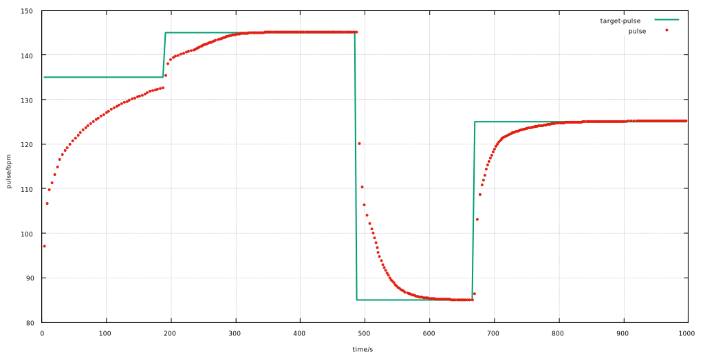
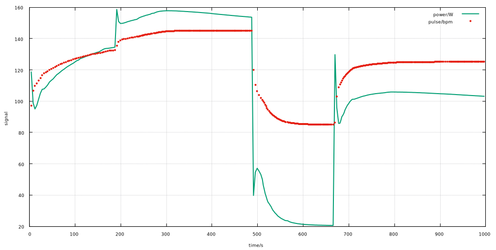

# state-machine

graph LR
   A((A))--0/0-->C((C))
   A((A))--1/0-->B((B))

   B((B))--0/0-->C((C))
   B((B))--1/0-->A((A))

   C((C))--0/0-->C((C))
   C((C))--1/0-->DF((DF))

   DF((DF))--0/0-->E((E))
   DF((DF))--1/0-->A((A))

   E((E))--0/0-->C((C))
   E((E))--1/1-->DF((DF))
   
   
 
 

